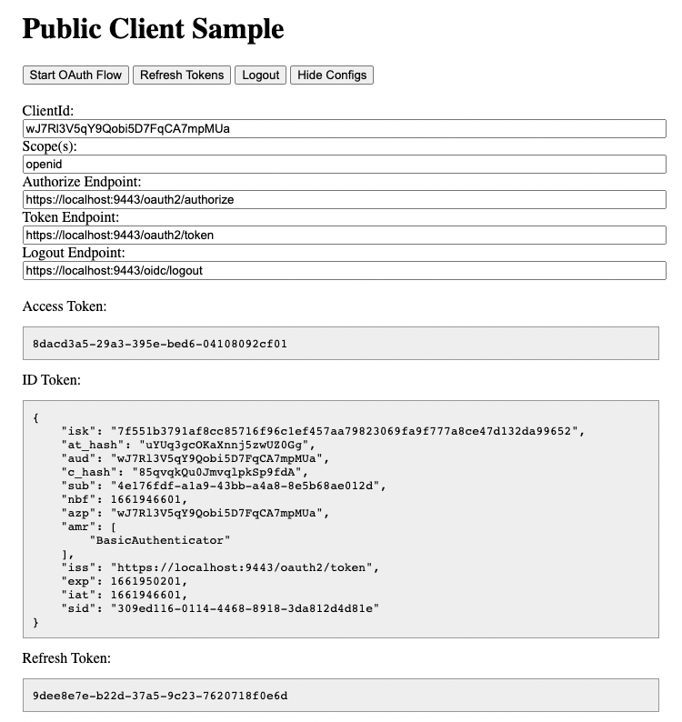

# A Simple JavaScript PKCE Example

## Introduction

Proof Key for Code Exchange (PKCE) is a technique described in [RFC7636](https://tools.ietf.org/html/rfc7636), and is used to mitigate the risk of the authorization code being hijacked. 

## Configuration

### OAuth Server with [WSO2 Identity Server](https://wso2.com/identity-server/)

It is required to crete a service provider and configure the "Callback Url" as `http://localhost:8080` (if locally running) or `https://rksk.net/pkce-javascript-example/` (if using github pages).

Moreover, it is required to enable `Allow authentication without the client secret` under the OAuth2 configurations.

Then, the OAuth2 client ID can be copied into `ClientId` field of the webapp. The other fields can also be modified as per the requirements.



## Serving the Sample HTML File

The HTML needs to be served somehow from a Web server. Because the client is just a static HTML page, this can be done with a trivial server configuration. These are a couple of different ways to very easily server the static HTML page:

```sh
$ npx http-server -p <port>
```

```sh
$ php -S <host>:<port>
```

```sh
$ python -m SimpleHTTPServer <port>
```

```sh
$ python3 -m http.server <port>
```

These will not use TLS, but are fast and easy ways to serve the HTML file without setting up any infrastructure.

## License

The code and samples in this repository are licensed under the [Apache 2 license](LICENSE).